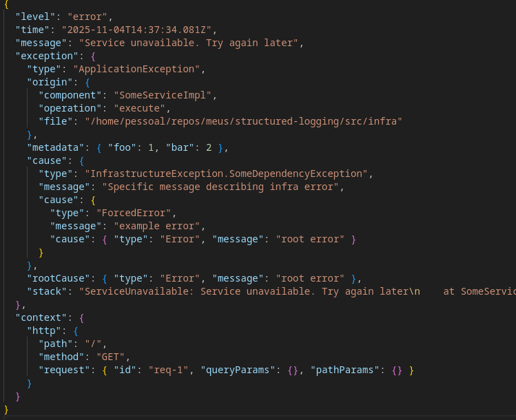

# Exemplo de Logs Estruturados

Este projeto demonstra boas práticas para implementação de logs estruturados em uma aplicação TypeScript, mostrando como gerenciar logs de forma eficiente com contexto e múltiplos destinos de transporte.

## Tecnologias Utilizadas

- **TypeScript** - Linguagem
- **Node.js** - JavaScript runtime
- **Fastify** - Framework web
- **Pino** - Logger simples e performático
- **Biome** - Para formatação e linting de código

## Por que Logs Estruturados?

Logs estruturados são cruciais em aplicações modernas por várias razões:

1. **Melhor Depuração** - Logs estruturados fornecem contexto e relações entre as entradas de log, facilitando o rastreamento de problemas e entendimento do comportamento do sistema.

2. **Formato Universal** - Logs formatados em JSON podem ser facilmente integrados a ferramentas de observabilidade com por exemplo OpenTelemetry

3. **Preservação de Contexto** - A implementação mostra como manter o contexto em diferentes partes da aplicação, facilitando o rastreamento de requisições e operações.

4. **Múltiplos Destinos de Transporte** - Demonstra como enviar logs para diferentes destinos (console, arquivos, envio de email, serviços externos) mantendo o mesmo formato estruturado.

5. **Performance** - Fazer o logging de forma assíncrona é essencial para não ter problemas de performance, utilizei a lib pino por esse motivo

## Boas práticas implementadas
1. **Não expor camada de infraestrutura** - As exceções são tratadas de forma que a mensagem final devolvida pela api seja genérica, sem expor detalhes de implementação

2. **Tratamento** - É utilizado um wrapper para enriquecer os erros, após o tratamento o erro é disparado para cima até que chegue num handler que esteja em mais alto nível

## Testar
```
npm i
npm run start
curl http://localhost:3000
```

> resultado

